[](https://classroom.github.com/a/mRmkZGKe)
# Network Programming - Assignment G01

## Anggota Kelompok
| Nama           | NRP        | Kelas     |
| ---            | ---        | ----------|
| Qurrata Ayun Kamil    |  5025241031   |  D  |
|                |            |           |

## Link Youtube (Unlisted)

https://youtu.be/IkjmSriDmrk
---

## Deskripsi Singkat

Program ini adalah **TCP Chat Server dengan File Transfer** yang diimplementasikan menggunakan 4 pendekatan berbeda:
- **Synchronous** - Blocking, satu client setiap waktu
- **Select** - I/O multiplexing, cross-platform
- **Poll** - I/O multiplexing, Linux-optimized
- **Threading** - Satu thread per client

Plus satu klien terminal yang bisa terhubung ke salah satu server.

---

## Penjelasan Program

Program ini merupakan sistem **TCP Chat Server dengan File Transfer** yang diimplementasikan dalam Python. Terdapat satu klien dan empat varian server dengan teknik penanganan koneksi berbeda.

### 1. **client.py** - Terminal Chat Client

Klien yang terhubung ke server untuk melakukan komunikasi chat dan transfer file.

**Fitur:**
- Menampilkan prompt `>` untuk input user
- **Commands:**
  - `/list` - Lihat file di server
  - `/upload <filename>` - Upload file lokal ke server
  - `/download <filename>` - Download file dari server
  - Chat biasa dikirim ke semua client
- **Threading:** Dua thread untuk concurrent I/O
  - Thread utama: handle user input
  - Thread background: receive messages/files dari server
- **File transfer:**
  - Download ke folder `downloads/`
  - Protocol: Server kirim header `FILE <name> <size>\n` lalu raw bytes
  - Klien parse header dan terima data biner

**Cara kerja:**
```python
# Thread background menerima data
def receive_loop(sock):
    while not stop_event.is_set():
        data = sock.recv(BUFFER_SIZE)
        
        if download_state['active']:
            # Sedang download: tulis ke file
            write chunk to file
        else:
            # Normal text mode: print message atau parse FILE header
            if line starts with 'FILE':
                parse header, open output file
                set download_state['active'] = True
```

---

### 2. **server-sync.py** - Synchronous Server (Port 5000)

Server paling sederhana yang menangani **satu client setiap waktu secara blocking**.

**Cara kerja:**
- `accept()` menunggu sampai ada client yang connect
- Proses client tersebut sampai disconnect
- Baru menerima client berikutnya
- **Keterbatasan:** Jika client 1 idle, client 2 harus menunggu di queue accept()

**Implementasi:**
```python
while True:
    conn, addr = server.accept()
    handle_client(conn, addr)  # Blocking sampai client disconnect
```

**Operasi:**
- `/list` - List files dari `server_files/`
- `/upload <name> <size>` - Receive file from client
- `/download <name>` - Send file to client
- Chat message - Broadcast ke semua client yang terhubung

**Keuntungan:** Sangat sederhana, cocok untuk demo/pembelajaran

---

### 3. **server-select.py** - Select-based Server (Port 5001)

Server yang menggunakan **`select()`** untuk menangani multiple clients dalam single thread.

**Cara kerja:**
- `select()` memantau semua client sockets sekaligus
- Return hanya sockets yang siap read/write
- Process mereka secara sequential
- Loop terus untuk check sockets baru

**Implementasi:**
```python
read_sockets = [server_sock]

while True:
    readable, _, exceptional = select.select(read_sockets, [], read_sockets, 1.0)
    
    for sock in readable:
        if sock is server_sock:
            conn, addr = server_sock.accept()
            read_sockets.append(conn)
        else:
            data = sock.recv(BUFFER_SIZE)
            handle_data(sock, data, read_sockets)
```

**Keunggulan:**
- Bisa handle ratusan clients bersamaan
- Single thread (no context switching overhead)
- Cross-platform (Windows, Linux, macOS)

---

### 4. **server-poll.py** - Poll-based Server (Port 5002)

Server yang menggunakan **`select.poll()`** untuk multiplexing yang lebih efisien (Linux-only).

**Perbedaan dari select():**
- `poll()` lebih scalable (O(n) vs O(n²))
- Bisa handle ribuan clients lebih baik
- Event mask lebih detail (POLLERR, POLLHUP, etc)
- Hanya Linux/Unix, tidak ada di Windows

**Implementasi:**
```python
poller = select.poll()
poller.register(server_fd, select.POLLIN)

while True:
    events = poller.poll(1000)  # Hanya return active fds
    
    for fd, event in events:
        if event & (select.POLLERR | select.POLLHUP):
            disconnect_client(fd, poller)
        elif fd == server_fd:
            accept new connection
        else:
            handle client data
```

**Keunggulan:**
- Scalable untuk 1000+ clients di single machine
- Lebih efisien untuk high-concurrency workload
- Standard di production Linux servers

---

### 5. **server-thread.py** - Threading Server (Port 5003)

Server yang spawning **satu thread per client** untuk handling concurrent connections.

**Cara kerja:**
- Main thread accept connections
- Untuk setiap client baru, spawn daemon thread baru
- Thread itu run `handle_client()` yang blocking
- Semua threads berjalan parallel (real concurrency)

**Implementasi:**
```python
while True:
    conn, addr = server.accept()
    t = threading.Thread(target=handle_client, args=(conn, addr), daemon=True)
    t.start()
    print(f'Active threads: {threading.active_count() - 1}')
```

**Thread-safety:**
- Semua threads share dict `clients` 
- Perlu `threading.Lock()` untuk protect access
- Broadcast acquire lock, copy target list, release lock

```python
clients_lock = threading.Lock()
clients = {}

def broadcast(message, sender_sock=None):
    with clients_lock:
        targets = list(clients.keys())
    
    for sock in targets:
        if sock is sender_sock: continue
        sock.sendall(message.encode())
```

---

## Perbandingan Teknik

| Teknik | Port | Clients | CPU | Memory | Kompleksitas | Best For |
|--------|------|---------|-----|--------|--------------|----------|
| Sync | 5000 | 1 | ⬇️ Rendah | ⬇️ Rendah | ⬇️ Mudah | Demo/Learning |
| Select | 5001 | 500 | ➡️ Sedang | ⬇️ Rendah | ➡️ Sedang | Prod cross-platform |
| Poll | 5002 | 1000+ | ⬇️ Rendah | ⬇️ Rendah | ➡️ Sedang | Prod Linux |
| Thread | 5003 | 100-500 | ⬆️ Tinggi | ➡️ Sedang | ⬇️ Mudah | I/O-heavy workload |

---

## Cara Menjalankan

**Terminal 1 - Jalankan salah satu server:**
```bash
python server-sync.py    
# atau server-select.py / server-poll.py / server-thread.py
```

**Terminal 2+ - Jalankan klien:**
```bash
python client.py [host] [port]
# Contoh: python client.py 127.0.0.1 5000
```

**Default:**
- Host: `127.0.0.1`
- Port: client terhubung ke 5003 (thread), ganti dengan berikut untuk terhubung ke server metode lain:
    - 5000 : sync
    - 5001 : select
    - 5002 : poll
    - 5003 : thread

## Tabel Perbandingan Teknis Detail

| Aspek | Sync | Select | Poll | Thread |
|-------|------|--------|------|--------|
| **Concurrency Model** | Sequential blocking | Single-threaded multiplexing | Single-threaded multiplexing | Multi-threaded |
| **Clients max** | 1 | ~500 | 1000+ | ~500 praktis |
| **CPU Usage** | Rendah-Sedang | Sedang | Rendah | Tinggi |
| **Memory per client** | Minimal | Minimal | Minimal | 1-8MB |
| **Response time** | Lambat jika blocked | Fast dan consistent | Fast dan consistent | Variable |
| **Context switching** | Tidak ada | Minimal | Minimal | Banyak |
| **Platform** | Semua | Semua | Linux/Unix only | Semua |
| **Complexity** | Mudah | Sedang | Sedang | Mudah |
| **Scalability** | Sangat rendah | Sedang | Tinggi | Sedang |
| **Thread-safety** | N/A | N/A | N/A | Complex |
| **Best practice** | Learning only | Production web | Production realtime/gaming | I/O-heavy apps |

## Screenshot Hasil

### Thread

1. Broadcast:

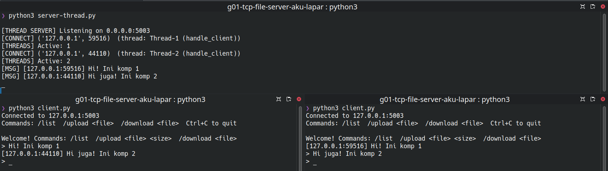

2. Upload 

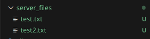
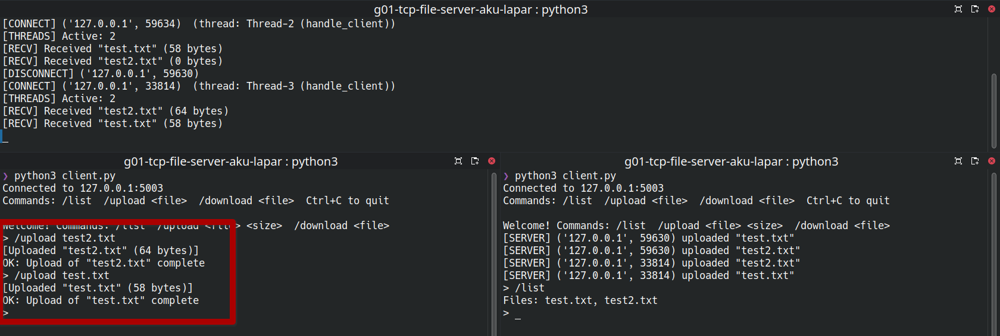

3. List

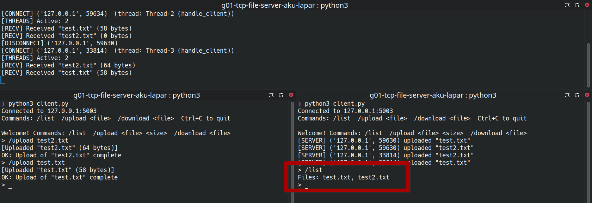

4. Download

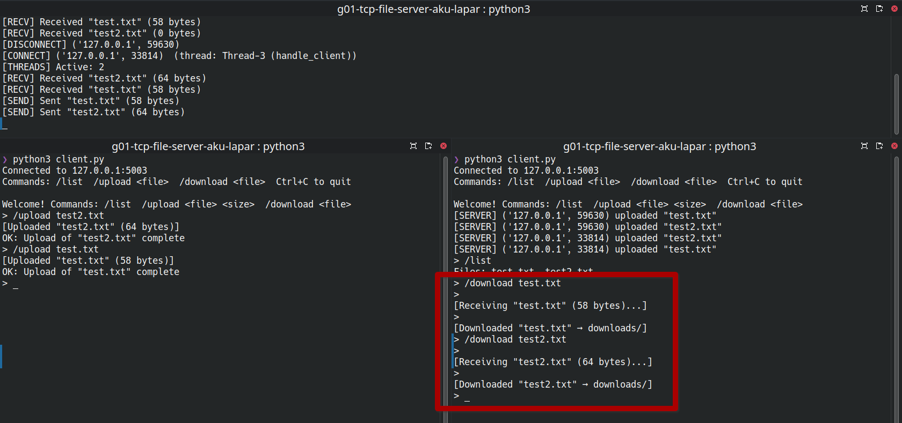
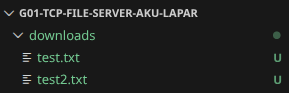

### Sync

1. Broadcast

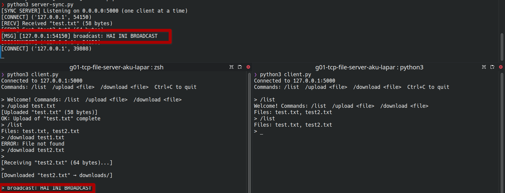

2. Upload

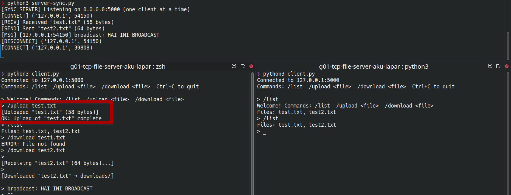

3. List

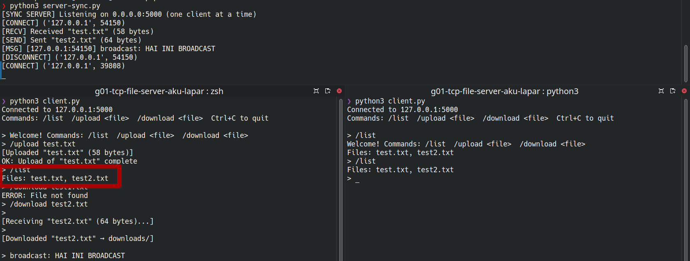

4. Download

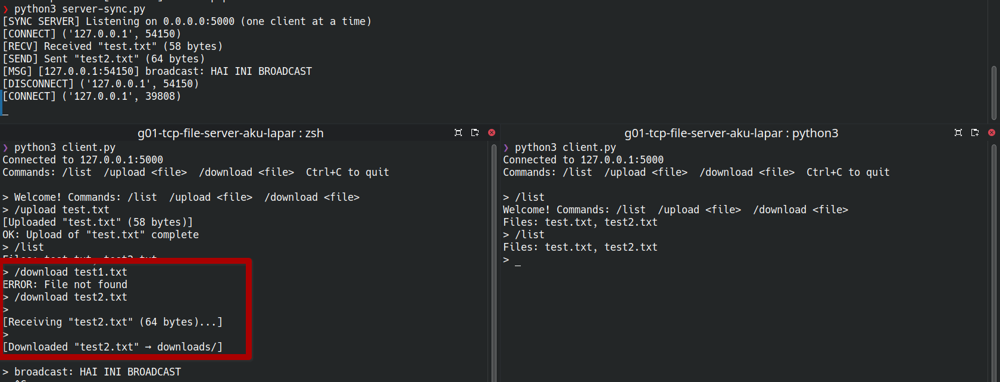

5. One client close, one client open

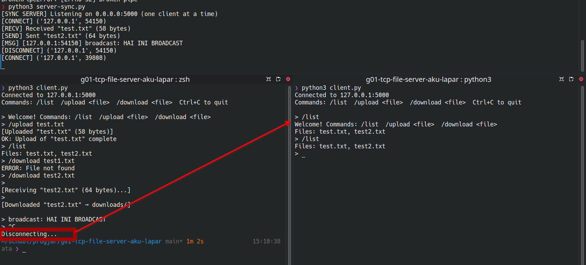

### Select

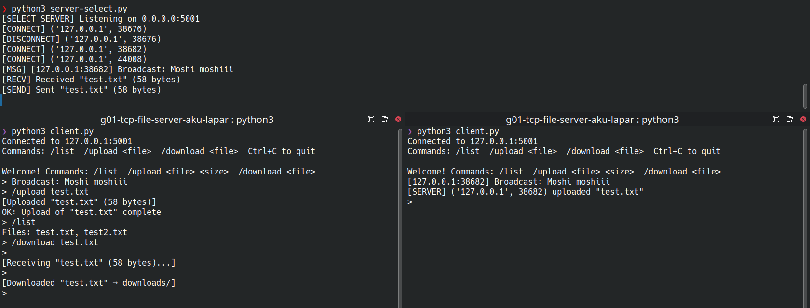

### Poll

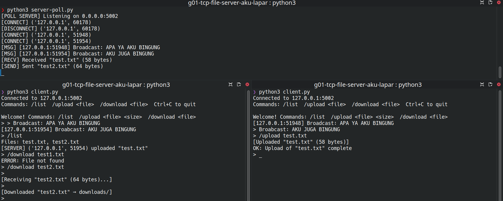